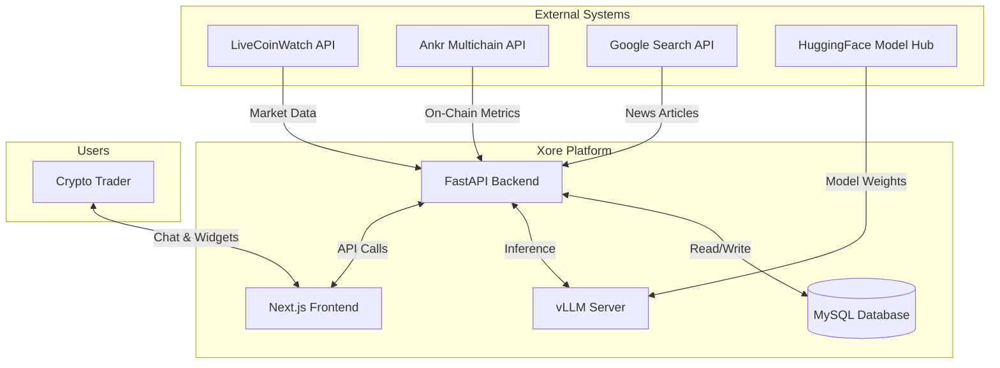
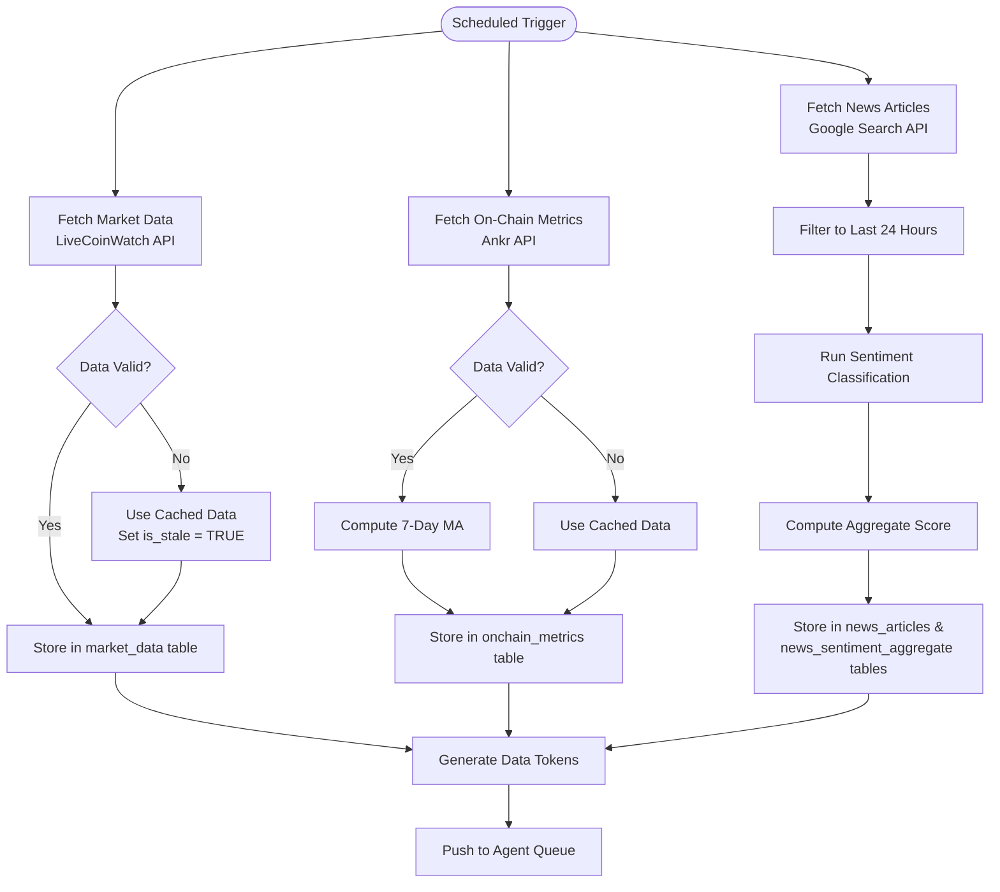
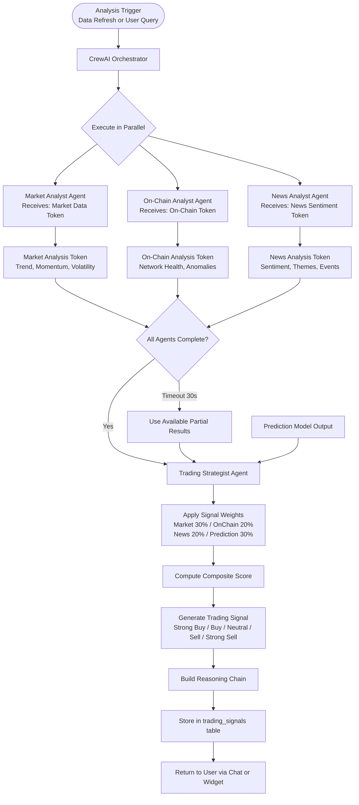
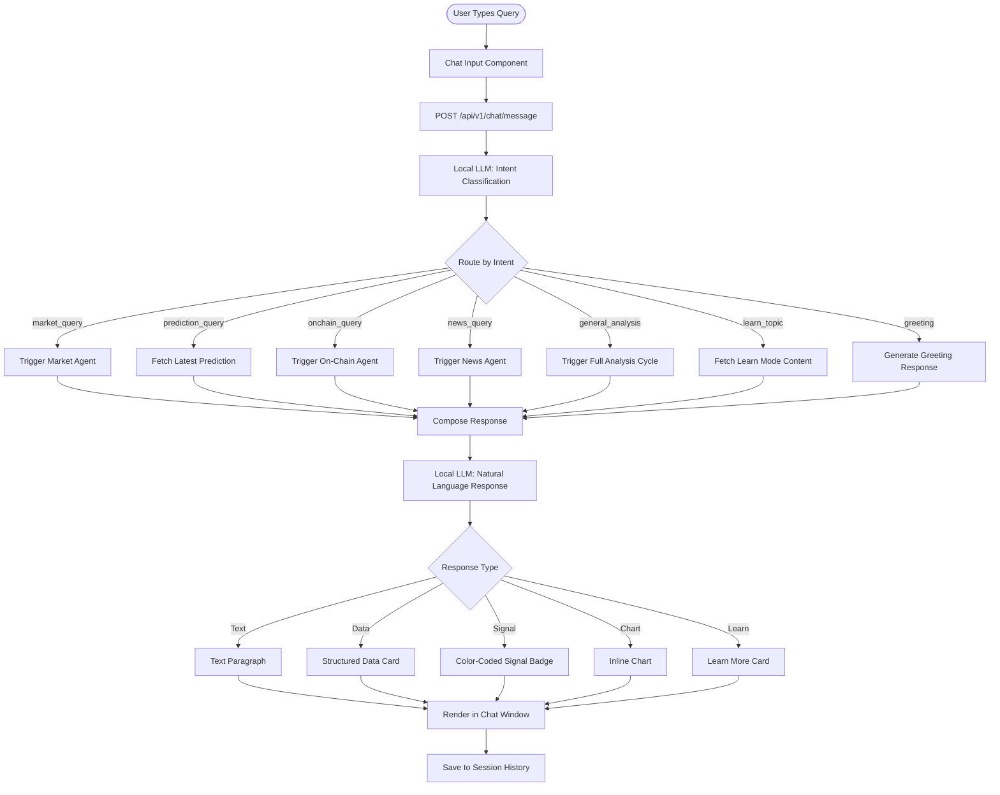
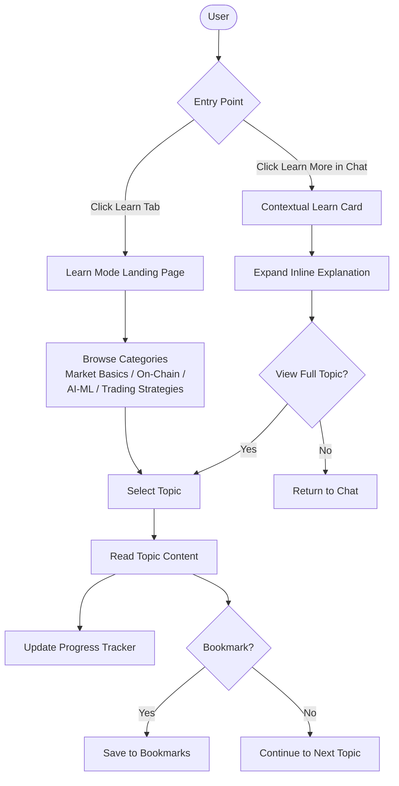
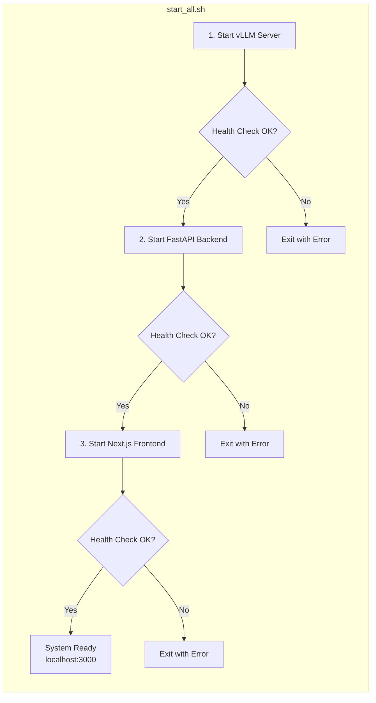

# Process Flows & Data Flow Diagrams: Xore

## Document Control

| Field | Value |
|-------|-------|
| Document ID | XORE-PF-001 |
| Version | 1.2 |
| Author | Pinky Choudhary, Business Analyst |
| Tools | MS Visio (original), Mermaid (repository version) |
| Last Updated | 2025-10-15 |

---

## 1. System Context Diagram

Shows Xore's boundaries and external interactions.

---

## 2. Data Ingestion Pipeline Flow

---

## 3. Multi-Agent Analysis Flow

---

## 4. User Chat Query Flow

---

## 5. Prediction Model Pipeline Flow

```mermaid
flowchart TD
    subgraph Training Pipeline - Weekly
        HIST[Fetch 1 Year Historical OHLCV] --> SPLIT[Split: 80% Train / 10% Val / 10% Test]
        SPLIT --> NORM[Min-Max Normalization]
        NORM --> WINDOW[Create 30-Day Rolling Windows]
        WINDOW --> TRAIN[Train Transformer-GRU Model]
        TRAIN --> EVAL{Accuracy >= 60%?}
        EVAL -->|Yes| PROMOTE[Promote as Active Model]
        EVAL -->|No| RETAIN[Retain Previous Model]
        PROMOTE --> LOG[Log Metrics to Notebook]
        RETAIN --> LOG
    end

    subgraph Inference Pipeline - On Demand
        RECENT[Fetch Latest 30 Days OHLCV] --> NORM_INF[Normalize with Saved Scaler]
        NORM_INF --> MODEL[Run Through Active Model]
        MODEL --> OUTPUT[Direction + Confidence]
        OUTPUT --> STORE[Store in predictions table]
        STORE --> SERVE[Serve via GET /api/v1/prediction/latest]
    end
```

---

## 6. Learn Mode User Flow

---

## 7. Deployment Architecture Flow

---

## 8. Diagram Source Files

The Mermaid diagrams above are also available as standalone files in the `diagrams/` directory for use in Visio, Lucidchart, or other tools:

- `diagrams/system-context.mermaid`
- `diagrams/agent-interaction-flow.mermaid`
- `diagrams/data-pipeline.mermaid`
- `diagrams/user-journey.mermaid`
